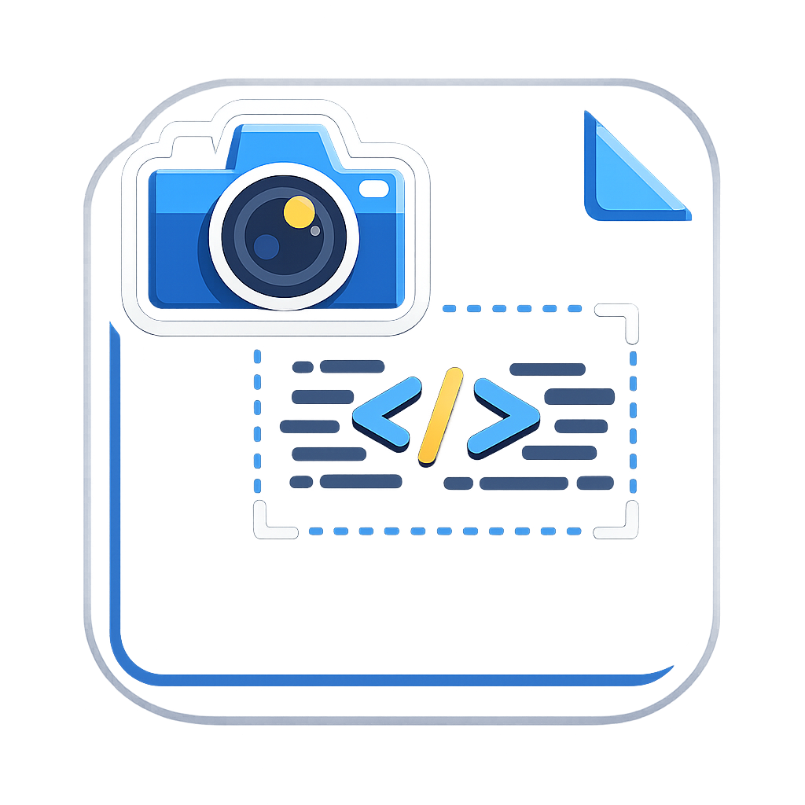

#  CodeShotX — chronic

Capture beautiful, high-fidelity code screenshots directly from VS Code. 🚀 It renders your code inside a professional A4-style layout with accurate line numbers and real-time updates.

## ✨ Features

- **Professional A4 Layout**: Renders code on a clean, white A4 sheet style background.
- **Real-Time Preview**: The preview updates instantly as you change your selection or edit your code (debounced for performance).
- **Accurate Line Numbers**: Maintains actual file line numbers in the screenshot.
- **Syntax Highlighting**: Powered by **Shiki**, ensuring your code looks exactly as it does in your editor.
- **High-Quality Export**: Generates high-DPI PNG screenshots suitable for documentation, blog posts, or social media.
- **Lightweight & Native**: Runs entirely inside VS Code with minimal resource usage.

## 🚀 How to Use

### 1. Capture via Context Menu
1. Select the code you want to capture in any editor.
2. **Right-click** and select **Capture Code Screenshot**.
3. A preview panel will open in a split view.

### 2. Keyboard Shortcut
1. Select your code.
2. Press `Ctrl + Alt + J` (Windows/Linux) or `Cmd + Alt + J` (macOS).

### 3. Save or Copy
- Use the **Save as PNG** button to save the screenshot using the native VS Code save dialog.
- The preview renders with a 2x pixel ratio for crisp quality.

## 🛠️ Manual Installation

If you have a `.vsix` file and want to install it manually:

### 1. Build the VSIX
If you are building from source, first run:
```bash
npm run package
```
This will generate a `codeshot-X.X.X.vsix` file in the root directory.

### 2. Install in VS Code
- **Method A (Command Palette)**: Press `Ctrl+Shift+P`, type `Install from VSIX`, and select the generated file.
- **Method B (Extensions View)**: Open the **Extensions** view (`Ctrl+Shift+X`), click the **...** (Views and More Actions) menu in the top-right corner, and select **Install from VSIX...**.

## 🛠️ Technical Implementation

- **Extension Host**: TypeScript
- **Syntax Highlighting**: [Shiki](https://shiki.matsu.io/) (lightweight build)
- **Screenshot Engine**: [html-to-image](https://github.com/bubkoo/html-to-image)
- **Layout**: Vanilla CSS (A4 sheet effect)

## 📦 Developer Setup

If you want to contribute or build the extension from source:

1. Clone the repository:
   ```bash
   git clone https://github.com/chronic-int/codeShot-VScode-Extension.git
   ```
2. Install dependencies:
   ```bash
   npm install
   ```
3. Compile the extension:
   ```bash
   npm run compile
   ```
4. Run in VS Code:
   - Press `F5` to open a new **Extension Development Host** window.

## 📝 License

This project is licensed under the ISC License.

---

Built with ❤️ for developers who love clean documentation.
